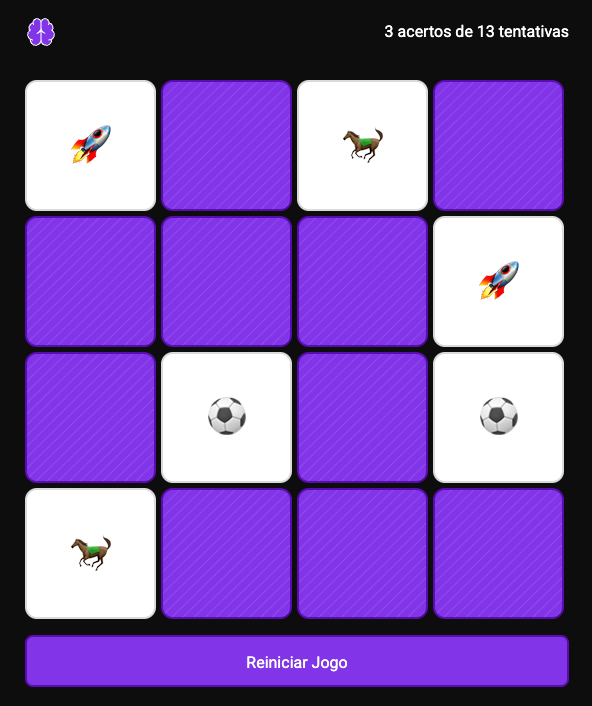

<h1 align="center"> 🃏 Jogo da Memória </h1>

### 📸 Prévia do Jogo

  

Um **jogo da memória** simples e divertido, desenvolvido com **HTML**, **CSS** e **JavaScript**.  
O projeto foi publicado no **GitHub Pages** para acesso rápido e fácil.

---

### 🚀 Demonstração

👉 [Jogar agora no GitHub Pages](https://julio-fh.github.io/memory/)

---

### 🛠️ Tecnologias Utilizadas

- **HTML5** – estrutura da aplicação  
- **CSS3** – design e responsividade  
- **JavaScript (ES6+)** – lógica do jogo  

---

### 🎮 Como Jogar

1. Clique em uma carta para virá-la.  
2. Clique em outra carta para tentar formar um par.  
3. Se as cartas coincidirem, elas permanecem viradas.  
4. O jogo termina quando todos os pares forem encontrados.  

---

### 📂 Estrutura do Projeto

📦 memory/

┣ 📜 index.html # Estrutura principal

┣ 📜 styles.css # Estilos e layout

┣ 📜 scripts.js # Regras e lógica do jogo

┣ 📜 README.md # Documentação do projeto

┗ 📜 assets/

┣ 📜 preview.png

┣ 📜 lines.svg

┗ 📜 logo.svg

---

### 🧩 Funcionalidades

- Animação de virar carta
- Verificação automática de pares
- Mensagem quando todos os pares são encontrados

---

### 🌟 Possíveis Melhorias

✅ Adicionar contador de tempo e número de tentativas

✅ Implementar níveis de dificuldade

✅ Criar ranking com melhores pontuações

✅ Incluir animações ao virar as cartas

---

### 📄 Licença

Este projeto está licenciado sob a MIT License – veja o arquivo LICENSE
para mais detalhes.

  

---

### 👨‍💻 Autor

Feito com ❤️ por Júlio Filho